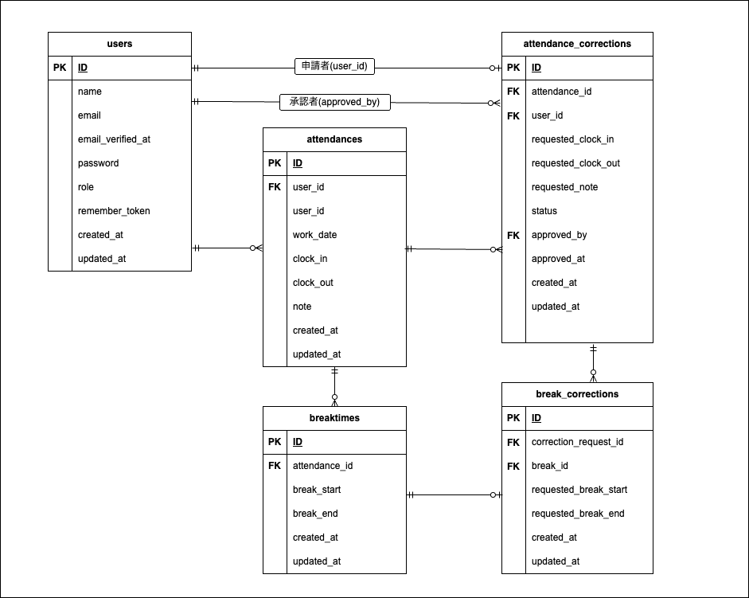

# 勤怠管理アプリ

[機能要件](https://docs.google.com/spreadsheets/d/17p-jmsXQr_Es3-n9rn6ox_B9ifDG317RwXj7JBGVmvs/edit?gid=1909938334#gid=1909938334) + 以下の応用要件を実装しています

- メールを用いた認証機能
- 認証メール再送機能
- 「承認待ち」の申請詳細は修正を行うことができず「承認待ちのため修正はできません。」とメッセージが表示される
- スタッフの月毎の勤怠情報のCSV出力機能

&nbsp;

## 環境構築

#### 1. リポジトリをクローン

```bash
git clone git@github.com:neuro-chan/attendance-app.git
cd attendance-app
```

#### 2. Docker Desktop を起動

`make init` 実行前にDocker Desktop を起動してください。

#### 3. 初期セットアップ

```bash
make init #プロジェクトルートで実行
```

`make init` では以下の処理が自動で実行されます

- Dockerイメージのビルド
- コンテナ起動
- .env（.env.example → .env）の配置
- Composerインストール
- アプリケーションキー生成
- DBのマイグレーション・初期データのシーディング
- bootstrap/cache の書き込み権限調整

&nbsp;

#### トラブルシューティング

`make init` 実行時に `Access denied` エラーが発生した場合は、以下のコマンドでボリュームを削除してから再実行してください。

```bash
docker compose down -v
make init
```

&nbsp;

## Mailtrapの設定

このプロジェクトでは開発環境のメール送信先としてMailtrapを使用しています。

1. [Mailtrap](https://mailtrap.io/) にログイン
2. My Sandboxを作成してメールボックスへアクセス
3. Integrations -> Code Samples から 「PHP Laravel 9.x」を選択
4. 右上のCopyボタンを使って「MAIL_MAILER」から「MAIL_PASSWORD」までの項目をコピーし`.env` に設定してください。
&nbsp;

※[公式ドキュメント](https://docs.mailtrap.io/getting-started/email-sandbox)

```env
MAIL_MAILER=smtp
MAIL_HOST=YOUR_MAILTRAP_HOST
MAIL_PORT=YOUR_MAILTRAP_PORT
MAIL_USERNAME=YOUR_MAILTRAP_USERNAME
MAIL_PASSWORD=YOUR_MAILTRAP_PASSWORD
MAIL_ENCRYPTION=null
MAIL_FROM_ADDRESS=test@example.com
MAIL_FROM_NAME="Local"
```
&nbsp;

## 使用技術

- バックエンド：Laravel 12 / PHP 8.3
- フロントエンド：HTML/ CSS/ JavaScript
- データベース：MySQL 8.0
- 開発環境：Docker / Nginx / phpMyAdmin
- バージョン管理：Git / GitHub
- メール（開発環境）：Mailtrap
- テスト：PHPUnit（Featureテスト）

&nbsp;

## 基本設計書

https://docs.google.com/spreadsheets/d/17p-jmsXQr_Es3-n9rn6ox_B9ifDG317RwXj7JBGVmvs/edit?gid=574125123#gid=574125123

&nbsp;

## テーブル仕様書

https://docs.google.com/spreadsheets/d/17p-jmsXQr_Es3-n9rn6ox_B9ifDG317RwXj7JBGVmvs/edit?gid=1188247583#gid=1188247583

&nbsp;

## ER図



&nbsp;

## 動作確認用URL

- スタッフログインページ: http://localhost/login
- 管理者ログインページ: http://localhost/admin/login
- ユーザー登録ページ: http://localhost/register

&nbsp;

## テストアカウント

動作確認用のテストユーザーです
| ユーザー名 | メールアドレス | パスワード | 備考 |
|---|---|---|---|
| test01 | testuser1@example.com | password | 表示確認用一般ユーザー |
| test02 | testuser2@example.com | password | 打刻動作確認用ユーザー |
| 管理者 | admin@example.com | adminpassword | 表示確認用管理者ユーザー |

&nbsp;

## Featureテスト（PHPUnit）

[テストケース一覧](https://docs.google.com/spreadsheets/d/17p-jmsXQr_Es3-n9rn6ox_B9ifDG317RwXj7JBGVmvs/edit?gid=203296433#gid=203296433) に従ったFeatureテストを用意しています

### テスト実行方法

プロジェクトルートで以下を実行してください。

```bash
make test
```

`make test` ではテスト実行に必要な処理がすべて自動で実行されます

- .env.testing の配置（.env.testing.example → .env.testing）
- テスト用アプリケーションキーの作成（docker compose exec -T php php artisan key:generate --env=testing）
- テスト用データベースの作成
- テスト用DBの初期化とマイグレーション（docker compose exec -T php php artisan migrate:fresh --env=testing）
- Featureテストの実行（php artisan test tests/Feature）

---

### テストファイルの構成

```
tests/
├── Feature/
│   └── Http/
│       └── Controllers/
│           ├── RegisterControllerTest.php             // ID1
│           ├── LoginControllerTest.php                // ID2
│           ├── AttendanceControllerTest.php           // ID4〜ID10
│           ├── AttendanceCorrectionControllerTest.php // ID11
│           ├── EmailVerificationControllerTest.php    // ID16
│           └── Admin/
│               ├── AttendanceControllerTest.php       // ID3
│               ├── LoginControllerTest.php            // ID12〜ID13
│               ├── StaffControllerTest.php            // ID14
│               └── CorrectionApproveControllerTest.php // ID15
└── Unit/
```

